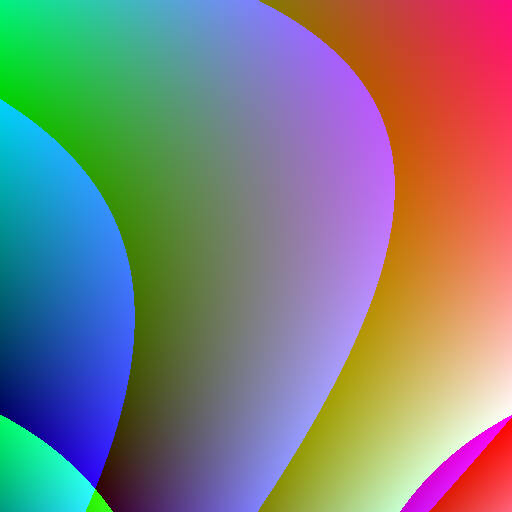

# RandomArt

Simple C implementation of the RandomArt generation algorithm described on this
[paper](http://users.ece.cmu.edu/~adrian/projects/validation/validation.pdf). It was also majorly inspired by Tsoding's
[implementation](https://github.com/tsoding/randomart), so thanks for the idea!!!

## Explanation
You should read the paper (and Tsoding's [skeet](https://bsky.app/profile/tsoding.bsky.social/post/3la5htxu4542x))
for a proper explanation, but the tl;dr of the algorithm is:
1. Generate a random AST describing a function which takes as input a pair of XY coordinates and returns a triple of
   RGB values, these values being in the range [-1, 1];
2. Run this AST for every pixel on your image;
3. Ta-da!

	
	
<i>Generated through the following function:</i> <code>rgb(x, mul(x, mul(add(y, add(add(y, y), mul(y, y))), 0.451108)), add(x, add(add(mul(x, y), mul(y, y)), x)))</code>

## Examples
Check `examples.md` for some nifty example images!

