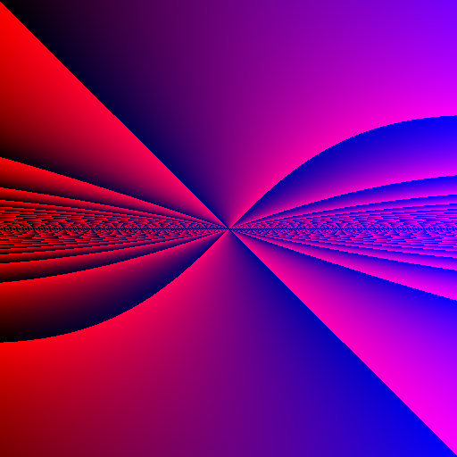
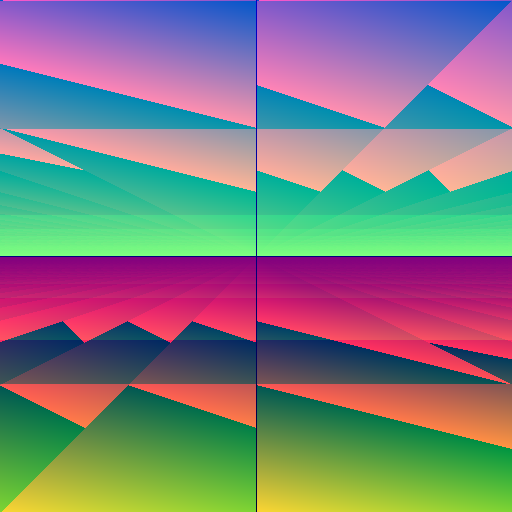
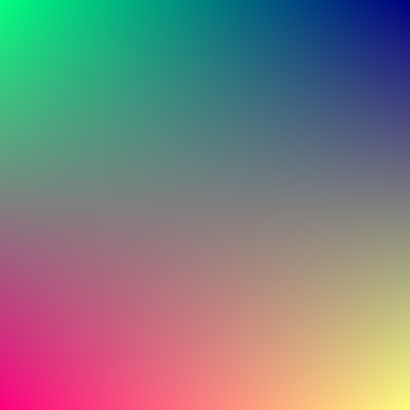
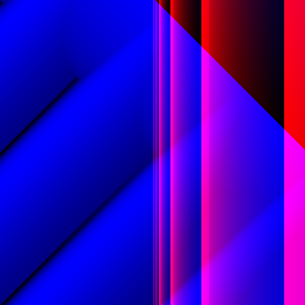

# Fun Examples
This file has some fun examples and their generator functions. Most were stumbled
upon by just re-running the tool a bunch.

## Chrono Trigger
`rgb(div(sub(cos(sub(y, x)), y), y), add(div(div(mul(x, y), add(y, x)), mul(mul(0.395887, x), mod(y, y))), add(sin(sin(sin(y))), div(mul(x, y), cos(0.0271352)))), add(y, if(>=(add(y, y), x), sub(x, y), cos(x))))`

## Geometric
`rgb(add(mod(rgb(div(-0.233838, mul(y, y)), div(mod(y, 0.0536739), y), rgb(x, y, div(rgb(cos(y), x, sin(y)), mul(y, -0.0782416)))), sub(y, add(x, 0.0102951))), add(0.3484, add(add(x, y), add(y, x)))), add(sub(rgb(mod(mod(y, y), mul(y, y)), 0.37293, y), div(mod(x, 0.678807), div(x, y))), add(sin(if(<=(y, y), y, y)), mul(x, mod(y, y)))), y)`

## Fields
`rgb(add(add(mod(sub(y, x), y), mod(add(y, y), div(x, x))), y), sub(sub(if(>(y, x), y, y), div(rgb(sub(y, y), mul(-0.821135, 0.713009), mul(y, y)), mul(y, y))), add(mod(sub(y, -0.327699), y), sub(div(x, x), y))), mul(cos(y), -0.702842))`

## Four Corners
`rgb(add(y, rgb(sub(cos(mod(x, 0.357165)), y), sub(div(y, 0.405363), sin(-0.880661)), div(-0.125798, sub(add(-0.0566517, y), y)))), mul(x, y), rgb(mod(cos(y), add(x, x)), mod(y, y), y))`

## Vaporwave
`f(x, y) = (rgb (sub (abs (exp (fract (abs (log x))))) 0.152519) (sqrt (mix (sqrt (min -0.54487 -0.0263508)) (exp (max -0.537712 x)) (cos (mod y -0.110695)))) (max (max (sqrt (sub x y)) (min (cos x) (abs -0.639572))) (sin (abs(log (fract (add x y)))))))`

