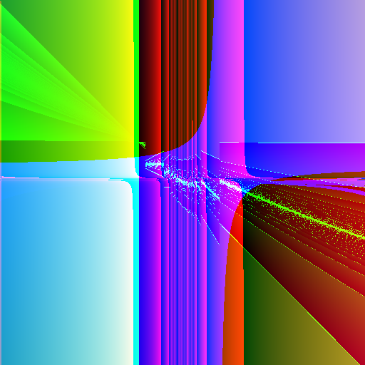
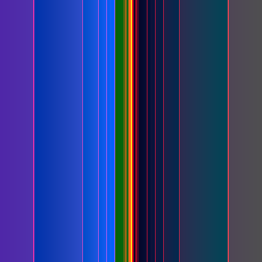

# Fun Examples

This file has some fun examples and their generator functions. Most were stumbled
upon by just re-running the tool a bunch.

## Chrono Trigger

`rgb(div(sub(cos(sub(y, x)), y), y), add(div(div(mul(x, y), add(y, x)), mul(mul(0.395887, x), mod(y, y))), add(sin(sin(sin(y))), div(mul(x, y), cos(0.0271352)))), add(y, if(>=(add(y, y), x), sub(x, y), cos(x))))`

## Geometric

`rgb(add(mod(rgb(div(-0.233838, mul(y, y)), div(mod(y, 0.0536739), y), rgb(x, y, div(rgb(cos(y), x, sin(y)), mul(y, -0.0782416)))), sub(y, add(x, 0.0102951))), add(0.3484, add(add(x, y), add(y, x)))), add(sub(rgb(mod(mod(y, y), mul(y, y)), 0.37293, y), div(mod(x, 0.678807), div(x, y))), add(sin(if(<=(y, y), y, y)), mul(x, mod(y, y)))), y)`

## Fields

`rgb(add(add(mod(sub(y, x), y), mod(add(y, y), div(x, x))), y), sub(sub(if(>(y, x), y, y), div(rgb(sub(y, y), mul(-0.821135, 0.713009), mul(y, y)), mul(y, y))), add(mod(sub(y, -0.327699), y), sub(div(x, x), y))), mul(cos(y), -0.702842))`

## Four Corners

`rgb(add(y, rgb(sub(cos(mod(x, 0.357165)), y), sub(div(y, 0.405363), sin(-0.880661)), div(-0.125798, sub(add(-0.0566517, y), y)))), mul(x, y), rgb(mod(cos(y), add(x, x)), mod(y, y), y))`

## Vaporwave

`f(x, y) = (rgb (sub (abs (exp (fract (abs (log x))))) 0.152519) (sqrt (mix (sqrt (min -0.54487 -0.0263508)) (exp (max -0.537712 x)) (cos (mod y -0.110695)))) (max (max (sqrt (sub x y)) (min (cos x) (abs -0.639572))) (sin (abs(log (fract (add x y)))))))`

## Giygas

`f(x, y) = (rgb (sub (mod (sub (mul 0.947441 y) (add x 0.261177)) (mod (sub 0.16587 x) (div 0.93128 x))) (div (sub y (sub x 0.120607)) (mul (mod 0.955135 y) (sub 0.535825 x)))) (mul (add (sub (div y x) (add 0.561929 x)) (mod (sub y 0.662759) x)) x) y)`

## Collapse

`f(x, y) = (rgb (mod (add (div (div x 0.211992) (div x y)) y) y) (div 0.122605 (add (add (mul x 0.806234) (add x y)) y)) (add (sub (sub (sub 0.295714 y) (div 0.934116 y)) y) (add y (mul (mod x x) (mul x y)))))`

## Stroke

`f(x, y) = (rgb (sub (sub x (div (mul y 0.179603) (add y 0.0190984))) (div (sub (add x 0.405067) 0.0136063) (sub x (rgb y x 0.264116)))) (mod (sub (div (add 0.832435 x) (div y y)) (mul 0.711419 0.825349)) (sub (add y (mod 0.203747 x)) (mul (sub x y) (mix 0.894777 0.361406 y)))) (mul 0.343404 (mod (mul (add y 0.089752) (sub x 0.198278)) (div (add y y) (add x 0.119672)))))`

## Rainbow

`f(x, y) = (rgb (sin (sin (mod (cos (cos (div y y))) x))) (sin (fract (sin (cos (sin x))))) (cos (sin (cos (cos (add (add 0.249185 x) (sin x)))))))`

## Starfighter

`f(x, y) = (rgb (exp (if (> (cos (fract y)) 0.638717) (sin (sin x)) (sin (fract 0.865973)))) (cos (cos (exp (cos (sin (fract rnd)))))) (cos (rgb (exp (if (!= x y) y x)) (sqrt (sin (sqrt 0.260944))) (sin (sin (cos 0.508175))))))`

